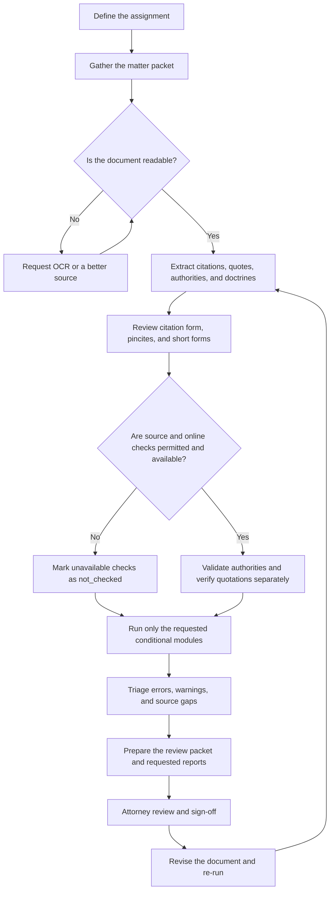

# Attorney And Paralegal Workflow Notes

Use this reference when the user wants a practical legal-team review process, not just raw citation extraction.

## Contents

- [Using DIFTCL In Practice](#using-diftcl-in-practice)
  - [Before You Begin](#before-you-begin)
  - [Full Matter Workflow](#full-matter-workflow)
  - [Workflow Diagram](#workflow-diagram)
  - [Start With This Prompt](#start-with-this-prompt)
  - [Focused Prompts](#focused-prompts)
  - [Understanding Results](#understanding-results)
  - [Handoff And Sign-Off](#handoff-and-sign-off)
- [Intake](#intake)
- [Matter Configuration](#matter-configuration)
- [Outputs By Role](#outputs-by-role)
- [Recommended Review Order](#recommended-review-order)
- [What To Escalate](#what-to-escalate)

## Using DIFTCL In Practice

DIFTCL is a first-pass legal quality-control assistant. It helps a legal team
find citation, quotation, authority, deadline, and issue-spotting problems
before an attorney decides what the document means and whether it is ready to
file. It is not legal advice and it does not replace attorney judgment.

### Before You Begin

Gather the smallest useful matter packet:

- the draft brief, motion, memorandum, reply, or other document;
- the filing court, jurisdiction, and document type;
- cited opinions or source excerpts when quote verification matters;
- the scheduling order or controlling rule when a deadline matters;
- the selected official local-rule source when local rules matter;
- permission to use online authority checks, if required by the matter; and
- the desired deliverable: summary, review packet, table of authorities,
  HTML, DOCX, or another supported format.

Do not send confidential or privileged material to an online service unless the
matter permits it. If a required source or permission is missing, run the
available local review and identify the missing check rather than guessing.

### Full Matter Workflow

Use the following sequence for a filing-readiness or comprehensive matter
review:

1. **Define the assignment.** State whether the goal is cite-checking, quote
   verification, authority extraction, deadline review, strategy review, or a
   complete first pass.
2. **Confirm the document is readable.** Check that the text was extracted
   completely, especially when the source is a scanned PDF. Stop and request
   OCR or a better source when the text is incomplete.
3. **Build the authority inventory.** Extract full case citations, `Id.`,
   `supra`, statutes, regulations, rules, constitutional provisions,
   doctrines, and quoted passages.
4. **Review citation form.** Check reporter form, case-name form, parentheticals,
   pincites, short forms, and likely filing-court issues.
5. **Validate authority and quotations separately.** A real case citation does
   not prove that a quotation is accurate. Use CourtListener or supplied source
   text only when available and permitted.
6. **Run conditional modules.** Review local rules only for the selected court;
   calculate deadlines only from supplied or configured rules; provide
   education and strategy notes only for the requested scope.
7. **Triage the findings.** Resolve errors and unsupported quotes first, then
   warnings, source gaps, short forms, and strategic issues.
8. **Prepare the work product.** Return a plain-language summary and a
   prioritized review packet. Add a table of authorities or HTML/DOCX report
   when requested and supported by the host.
9. **Obtain human sign-off.** An attorney confirms authority, quote context,
   current law, local rules, deadlines, strategy, and filing readiness.
10. **Re-run after edits.** Compare the revised document with the prior review,
    confirm resolved issues, and look for newly introduced problems.

### Workflow Diagram

This process map shows the normal legal-practice sequence. A matter does not
need every optional module, and `not_checked` is a handoff condition—not an
approval.



### Start With This Prompt

A non-technical user can begin with a prompt like this:

```text
Use DIFTCL to review the attached motion to dismiss as a filing-ready draft.

Matter:
- Court: U.S. District Court for the District of Minnesota
- Jurisdiction: federal
- Document type: motion to dismiss
- Review goal: citation, quotation, authority, and filing-readiness review

Please:
1. Confirm whether the document text was extracted completely.
2. Extract all case citations, short-form citations, statutes, rules, doctrines,
   and quotations.
3. Review citation form, pincites, and parentheticals.
4. Check case citations through CourtListener if available and permitted.
5. Verify quotations against the attached source opinions.
6. Identify unresolved local-rule and deadline questions.
7. Provide separate strategy, tactics, and contrarian observations.

Return:
- a plain-language summary;
- prioritized attorney/paralegal action items;
- a table-of-authorities draft; and
- the requested report artifact when the host supports it.

Do not invent case holdings, quote support, deadlines, or local rules. Mark
unavailable checks as “not checked.”
```

### Focused Prompts

Use focused follow-up prompts after the baseline review.

#### Quote Verification

```text
Use DIFTCL to review only the quotations in this brief.

For each quotation, identify the cited authority, location in the draft,
whether the exact language was found, which source was checked, and the action
required. Keep quote validity separate from citation validity.
```

#### Statutes, Rules, And Doctrines

```text
Use DIFTCL to extract every statute, regulation, procedural rule,
constitutional provision, and named doctrine from this memorandum.

For each item, provide the exact text found, location, normalized reference when
safe, official source to verify, neutral research note, and questions requiring
attorney review. Do not state that an authority is current, controlling, or
dispositive without verification.
```

#### Local Rules

```text
Use DIFTCL to review local-rule requirements for this filing.

Court: [court and division]
Official source selected by the user: [URL or attached rule document]

Use only this court and source. Do not crawl other courts or guess requirements.
Report the source, retrieval limitations, and every requirement that needs
attorney confirmation.
```

#### Deadlines

```text
Use DIFTCL to calculate the response deadline from the attached scheduling order.

Identify the triggering event and date, controlling rule or order, counting
method, trigger-day treatment, holidays, weekend or holiday adjustment,
calculated deadline, assumptions, and attorney-review warning. If the rule is
unclear, do not guess.
```

#### Strategy And Contrarian Review

```text
Use DIFTCL to perform a contrarian review of this brief.

Separate Strategy, Tactics, and Contrarian Review. Identify vulnerable
citations, unsupported or unchecked quotations, missing pincites, adverse
authority gaps, procedural risks, and arguments opposing counsel or the court
may raise. Ground every point in the document and extracted authorities. Do not
invent holdings or procedural facts.
```

#### Rerun After Edits

```text
Re-run the DIFTCL review on brief-revised.docx using the prior audit as the
comparison point.

Identify resolved issues, remaining issues, newly introduced issues, changed
quotations, and table-of-authorities changes. Regenerate the requested final
reports.
```

### Understanding Results

Treat each result as a separate check:

- **ok**: supported as far as the available source and check permit;
- **warning**: a style issue, ambiguity, or human-review item;
- **error**: an invalid or missing citation, or unsupported quotation; and
- **not_checked**: the required source, connection, permission, or rule was
  unavailable.

“Not checked” is not approval. The legal team should generally address
unsupported quotations and unmatched authorities before general style warnings.

### Handoff And Sign-Off

For paralegal or legal-ops work, preserve the draft version, source list,
review date, report, and unresolved action items. For attorney review, separate
mechanical citation findings from legal-significance questions. Before filing,
an attorney must confirm authority, quote context, current law, local rules,
deadlines, strategic conclusions, and the final document.

## Intake

Ask for the smallest set of facts needed to reduce rework:

- target filing court or jurisdiction;
- document type;
- whether the document is a draft, filing-ready brief, memo, motion, or cite-check assignment;
- whether CourtListener lookup is allowed;
- whether local-rule population is allowed and which court/rules URL the user wants checked;
- whether deadline calculation is requested and what rule/order controls it;
- whether strategy, tactics, or contrarian review is requested;
- whether statute/rule/doctrine education notes are requested;
- whether source authority text is supplied or may be fetched;
- whether the user wants a review packet, JSON, or table-of-authorities draft.

If the user provides a document but no court or document type, run a neutral audit first and call out that local rules may change the final citation form.

## Matter Configuration

Prefer a matter-level `diftcl.yaml` when repeat audits will happen on the same matter. Start from `templates/diftcl.yaml`.

Common settings:

```yaml
filing_court: "U.S. District Court, D. Minn."
jurisdiction: "federal"
document_type: "brief"
strict: true
courtlistener: true
verify_quotes: true
local_rules_enabled: true
local_rules_url: "https://www.mnd.uscourts.gov/court-info/local-rules-and-orders"
calendar_enabled: true
calendar_rules_file: "calendar-rules.json"
strategy_enabled: true
strategy_position: "defense"
doctrine_education_enabled: true
output_format: "review"
```

Use strict mode for filing-ready work. Strict mode should flag missing pincites for proposition citations and raise more issues for attorney review rather than silently accepting borderline citation forms.

For local-rule source selection and network safety, read `references/local-rule-sources.md` before any web fetch.

For deadline and strategy workflows, read `references/litigation-calendar-strategy.md`.

For doctrine/statute education workflows, read `references/doctrine-statute-education.md`.

## Outputs By Role

For attorneys:

- prioritize unsupported quotes, invalid authorities, ambiguous authority matches, and local-rule-sensitive calls;
- separate legal-significance issues from mechanical citation style;
- state when the source does not support a quote.

For paralegals:

- provide page/line locations;
- provide exact citation text found in the draft;
- provide suggested normalized reporter forms where supported;
- provide a table-of-authorities draft with mention counts and locations;
- identify short forms that require manual mapping.

For legal-ops or engineering:

- use JSON output for downstream systems;
- keep privileged source documents outside the repo;
- store only audit reports that are approved for the matter file.

## Recommended Review Order

1. Confirm text extraction quality, especially for PDF scans.
2. Review `error` findings before style warnings.
3. Resolve CourtListener `300`, `400`, `404`, and `429` outcomes.
4. Verify quotes independently from citation validity.
5. Resolve `Id.`, `supra`, and abbreviated references.
6. Check local rules only for the user-selected filing court, division, or judge source.
7. Calculate deadlines only from configured rule/order sources and verify holidays.
8. Extract and verify statutes, regulations, rules, constitutional provisions, and doctrine mentions.
9. Generate strategy/tactics/contrarian issue spotting if requested.
10. Generate or review the table of authorities.
11. Re-run after edits and compare counts/findings.

## What To Escalate

Escalate to an attorney before filing when:

- a quote is not found in the authority text;
- a citation cannot be matched to a known authority;
- a short-form citation has an unclear referent;
- local rules may require parallel citations, public-domain citations, or unpublished-case notices;
- a deadline depends on service method, emergency rules, a judge order, or an uncertain holiday calendar;
- a statute, regulation, or doctrine may depend on effective dates, amendments, elements, or controlling jurisdiction;
- an authority appears unpublished, nonprecedential, overruled, superseded, or otherwise risky.
